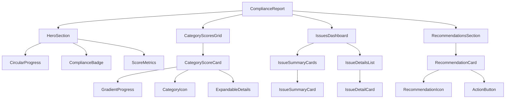

# VCA Compliance Report - Component Architecture

## Component Hierarchy



## Component Specifications

### 1. CircularProgress Component

**Purpose**: Display overall compliance score in a visually striking circular format

**Props**:
```typescript
interface CircularProgressProps {
  value: number;              // 0-100
  size?: 'sm' | 'md' | 'lg';  // 120px, 150px, 180px
  strokeWidth?: number;        // Default: 12
  showLabel?: boolean;         // Default: true
  animated?: boolean;          // Default: true
  gradient?: {
    from: string;
    to: string;
  };
  className?: string;
}
```

**Visual Design**:
- SVG-based circular progress
- Gradient stroke based on score
- Animated fill on mount (0 to value)
- Center displays: score percentage + status text
- Glow effect for high scores (90+)

**Implementation Notes**:
```tsx
// Use SVG circle with stroke-dasharray for progress
// Animate with CSS transition or Framer Motion
// Calculate circumference: 2 * π * radius
// Progress offset: circumference * (1 - value/100)
```

---

### 2. CategoryScoreCard Component (Enhanced)

**Purpose**: Display individual category scores with modern card design

**Props**:
```typescript
interface CategoryScoreCardProps {
  title: string;
  description: string;
  score: number;
  weight: number;
  icon: React.ComponentType;
  issues: string[];
  isExpanded?: boolean;
  onToggle?: () => void;
  className?: string;
}
```

**Visual Design**:
- Card with gradient border based on score
- Icon in gradient circle (48px diameter)
- Large score number (text-3xl)
- Gradient progress bar
- Weight indicator badge
- Hover: lift effect (translateY(-4px))
- Click: expand to show issues

**States**:
- Default: Collapsed, shows summary
- Hover: Elevated with increased shadow
- Expanded: Shows detailed issues list
- Loading: Skeleton animation

---

### 3. IssueSummaryCard Component

**Purpose**: Display count of issues by severity in compact format

**Props**:
```typescript
interface IssueSummaryCardProps {
  severity: 'CRITICAL' | 'HIGH' | 'MEDIUM' | 'LOW';
  count: number;
  onClick?: () => void;
  isActive?: boolean;
  className?: string;
}
```

**Visual Design**:
- Compact card (120px × 100px)
- Large icon at top (32px)
- Bold count number (text-2xl)
- Severity label (text-sm)
- Gradient background based on severity
- Click: filter issues by severity

**Color Mapping**:
```typescript
const severityConfig = {
  CRITICAL: {
    gradient: 'from-red-500 to-red-600',
    icon: XCircle,
    label: 'Kritiek'
  },
  HIGH: {
    gradient: 'from-orange-500 to-orange-600',
    icon: AlertCircle,
    label: 'Hoog'
  },
  MEDIUM: {
    gradient: 'from-yellow-500 to-yellow-600',
    icon: AlertTriangle,
    label: 'Gemiddeld'
  },
  LOW: {
    gradient: 'from-blue-500 to-blue-600',
    icon: Info,
    label: 'Laag'
  }
};
```

---

### 4. IssueDetailCard Component

**Purpose**: Display detailed information about a specific issue

**Props**:
```typescript
interface IssueDetailCardProps {
  issue: ComplianceIssue;
  onActionClick?: () => void;
  className?: string;
}
```

**Visual Design**:
- Card with left border (4px) in severity color
- Icon matching severity (24px)
- Issue message (font-medium)
- Suggestion text (text-sm, text-gray-600)
- Optional action button
- Field reference if available

**Layout**:
```
┌─────────────────────────────────────────┐
│ ┃ 🔴 Issue Title                        │
│ ┃                                       │
│ ┃ Issue description text goes here...  │
│ ┃                                       │
│ ┃ 💡 Suggestion: Action to take...     │
│ ┃                                       │
│ ┃ Veld: fieldName                       │
│ ┃                          [Action →]   │
└─────────────────────────────────────────┘
```

---

### 5. RecommendationCard Component

**Purpose**: Display actionable recommendations with priority

**Props**:
```typescript
interface RecommendationCardProps {
  number: number;
  icon: React.ComponentType;
  title: string;
  description: string;
  actionLabel?: string;
  onActionClick?: () => void;
  className?: string;
}
```

**Visual Design**:
- Light gradient background (blue/purple)
- Number badge in circle (32px)
- Icon next to title (20px)
- Description text (text-sm)
- Optional action link/button
- Hover: slight scale (1.02)

---

### 6. GradientProgress Component

**Purpose**: Enhanced progress bar with gradient fill

**Props**:
```typescript
interface GradientProgressProps {
  value: number;
  height?: number;           // Default: 8px
  gradient?: {
    from: string;
    to: string;
  };
  showLabel?: boolean;
  animated?: boolean;
  className?: string;
}
```

**Visual Design**:
- Rounded ends (border-radius: 9999px)
- Gradient fill based on value
- Optional glow effect
- Smooth fill animation
- Optional percentage label overlay

---

## Layout Structure

### Desktop Layout (> 1024px)

```
┌─────────────────────────────────────────────────────────┐
│                     HERO SECTION                         │
│              [Circular Progress + Badge]                 │
│                      (Full Width)                        │
└─────────────────────────────────────────────────────────┘

┌─────────────────────────────────────────────────────────┐
│                  CATEGORY SCORES GRID                    │
│  ┌─────────┐  ┌─────────┐  ┌─────────┐                │
│  │ Card 1  │  │ Card 2  │  │ Card 3  │                │
│  └─────────┘  └─────────┘  └─────────┘                │
│  ┌─────────┐  ┌─────────┐                              │
│  │ Card 4  │  │ Card 5  │                              │
│  └─────────┘  └─────────┘                              │
└─────────────────────────────────────────────────────────┘

┌─────────────────────────────────────────────────────────┐
│                   ISSUES DASHBOARD                       │
│  ┌────┐  ┌────┐  ┌────┐  ┌────┐                       │
│  │ C  │  │ H  │  │ M  │  │ L  │  Summary Cards         │
│  └────┘  └────┘  └────┘  └────┘                       │
│                                                          │
│  [Detailed Issues List - Expandable]                    │
└─────────────────────────────────────────────────────────┘

┌─────────────────────────────────────────────────────────┐
│                   RECOMMENDATIONS                        │
│  [Numbered Cards with Actions]                          │
└─────────────────────────────────────────────────────────┘
```

### Mobile Layout (< 640px)

```
┌─────────────────────┐
│   HERO SECTION      │
│  [Circular Progress]│
│     (Centered)      │
└─────────────────────┘

┌─────────────────────┐
│ CATEGORY SCORES     │
│  ┌───────────────┐  │
│  │   Card 1      │  │
│  └───────────────┘  │
│  ┌───────────────┐  │
│  │   Card 2      │  │
│  └───────────────┘  │
│  ┌───────────────┐  │
│  │   Card 3      │  │
│  └───────────────┘  │
│  (Stacked)          │
└─────────────────────┘

┌─────────────────────┐
│ ISSUES DASHBOARD    │
│  ┌────┐  ┌────┐    │
│  │ C  │  │ H  │    │
│  └────┘  └────┘    │
│  ┌────┐  ┌────┐    │
│  │ M  │  │ L  │    │
│  └────┘  └────┘    │
│  (2x2 Grid)        │
└─────────────────────┘
```

## State Management

### Component State

```typescript
interface ComplianceReportState {
  // Expanded categories
  expandedCategories: Set<string>;
  
  // Expanded issues section
  expandedIssues: boolean;
  
  // Active severity filter
  activeSeverityFilter: ComplianceIssue['severity'] | null;
  
  // Animation states
  isAnimating: boolean;
  
  // Loading states
  isLoading: boolean;
}
```

### Actions

```typescript
// Toggle category expansion
toggleCategory(categoryId: string): void

// Toggle issues section
toggleIssues(): void

// Filter by severity
filterBySeverity(severity: ComplianceIssue['severity'] | null): void

// Reset filters
resetFilters(): void
```

## Animation Specifications

### Entry Animations

```typescript
// Hero section fade in + scale
const heroAnimation = {
  initial: { opacity: 0, scale: 0.95 },
  animate: { opacity: 1, scale: 1 },
  transition: { duration: 0.5, ease: 'easeOut' }
};

// Category cards stagger
const cardAnimation = {
  initial: { opacity: 0, y: 20 },
  animate: { opacity: 1, y: 0 },
  transition: { duration: 0.3, ease: 'easeOut' }
};

// Stagger delay: index * 0.1s
```

### Interaction Animations

```typescript
// Card hover
const hoverAnimation = {
  scale: 1.02,
  y: -4,
  boxShadow: '0 20px 25px -5px rgba(0, 0, 0, 0.1)',
  transition: { duration: 0.2 }
};

// Expand/collapse
const expandAnimation = {
  height: 'auto',
  opacity: 1,
  transition: { duration: 0.3, ease: 'easeInOut' }
};
```

### Progress Animations

```typescript
// Circular progress
const progressAnimation = {
  strokeDashoffset: [circumference, finalOffset],
  transition: { duration: 1, ease: 'easeOut' }
};

// Score counter
const counterAnimation = {
  from: 0,
  to: actualValue,
  duration: 1000,
  ease: 'easeOut'
};
```

## Accessibility Features

### Keyboard Navigation

```typescript
// Tab order
1. Hero section (focusable for screen readers)
2. Category cards (Enter to expand)
3. Issue summary cards (Enter to filter)
4. Issue detail cards (Tab through)
5. Recommendation cards (Tab through actions)
```

### ARIA Labels

```typescript
// Circular progress
aria-label="Overall compliance score: {score} percent"
role="progressbar"
aria-valuenow={score}
aria-valuemin={0}
aria-valuemax={100}

// Category cards
aria-expanded={isExpanded}
aria-controls="category-details-{id}"

// Issue cards
aria-label="{severity} severity issue: {message}"
```

### Screen Reader Announcements

```typescript
// When score loads
announce("Compliance score loaded: {score} percent, {level}")

// When category expands
announce("Category {name} expanded, showing {count} issues")

// When filtering issues
announce("Filtered to {count} {severity} severity issues")
```

## Performance Optimizations

### Code Splitting

```typescript
// Lazy load heavy components
const CircularProgress = lazy(() => import('./CircularProgress'));
const IssueDetailsList = lazy(() => import('./IssueDetailsList'));
```

### Memoization

```typescript
// Memoize expensive calculations
const categoryScores = useMemo(
  () => calculateCategoryScores(result),
  [result]
);

// Memoize filtered issues
const filteredIssues = useMemo(
  () => filterIssuesBySeverity(issues, activeSeverity),
  [issues, activeSeverity]
);
```

### Virtual Scrolling

```typescript
// For large issue lists (> 50 items)
import { FixedSizeList } from 'react-window';

<FixedSizeList
  height={600}
  itemCount={issues.length}
  itemSize={120}
>
  {IssueRow}
</FixedSizeList>
```

## Testing Strategy

### Unit Tests

```typescript
// Component rendering
test('renders CircularProgress with correct value', () => {
  render(<CircularProgress value={85} />);
  expect(screen.getByText('85%')).toBeInTheDocument();
});

// Interactions
test('expands category on click', () => {
  const onToggle = jest.fn();
  render(<CategoryScoreCard onToggle={onToggle} />);
  fireEvent.click(screen.getByRole('button'));
  expect(onToggle).toHaveBeenCalled();
});
```

### Integration Tests

```typescript
// Full report rendering
test('renders complete compliance report', () => {
  render(<ComplianceReport result={mockResult} />);
  expect(screen.getByText('VCA Compliance Rapport')).toBeInTheDocument();
  expect(screen.getAllByRole('progressbar')).toHaveLength(6);
});

// Filtering
test('filters issues by severity', () => {
  render(<ComplianceReport result={mockResult} />);
  fireEvent.click(screen.getByText('Kritiek'));
  expect(screen.getAllByRole('article')).toHaveLength(2);
});
```

### Visual Regression Tests

```typescript
// Storybook + Chromatic
export const Default = () => <ComplianceReport result={mockResult} />;
export const LowScore = () => <ComplianceReport result={lowScoreResult} />;
export const HighScore = () => <ComplianceReport result={highScoreResult} />;
```

---

**Document Version**: 1.0  
**Created**: 2025-11-05  
**Status**: Ready for Implementation